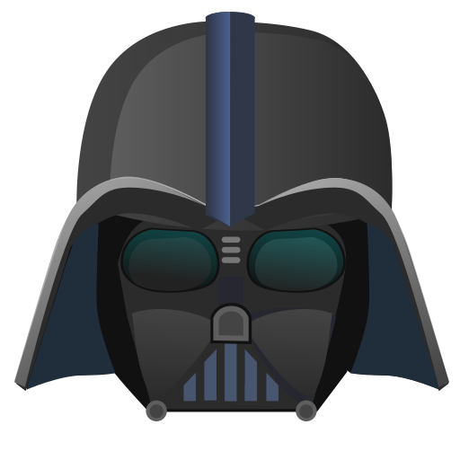
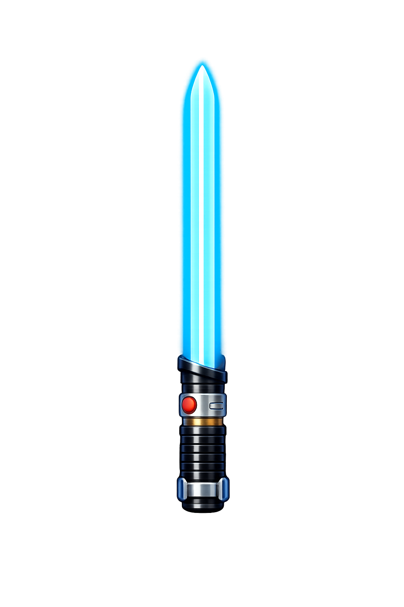

# Olá! Eu sou o Leonardo!   

💻 Estudante de Ciência da Computação (5º semestre)

• Atualmente estudando:

- C#
- .NET
- SQL
- Git
- Orientação a Objetos

Desenvolvendo aplicações em C# e explorando SQL por meio de projetos práticos, com foco na construção de uma base sólida em desenvolvimento Back-end.

• Objetivo:

- Buscando minha primeira oportunidade de estágio em Desenvolvimento Back-end com C# e .NET.

Foco principal: 

  
  
  
  

  Outros conhecimentos:

  
  
  
    

📫 Contato:

